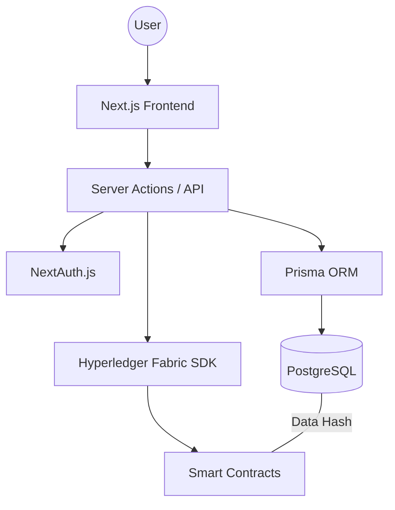

# 🩸 Hemoledger Blood Bank Management System: Traceability & Privacy


A secure, privacy-preserving, and traceable digital platform for managing the blood supply chain. Built with **Next.js**, **Hyperledger Fabric**, and **Prisma**, this system ensures data integrity and transparency while protecting sensitive medical information.

---

## 🌟 Overview

Traditional blood bank systems often suffer from lack of transparency, susceptibility to data tampering, and privacy risks. **Hemolegder** addresses these by leveraging a permissioned blockchain network to create an immutable audit trail for every blood unit, from donation to transfusion.

### Key Pillars
- **Traceability**: Real-time tracking of blood units across stakeholders.
- **Privacy**: Off-chain storage of PII with cryptographic hashes on-chain.
- **Trust**: Decentralized verification prevents unauthorized record modification.

---

## ✨ Features

- **Multi-Stakeholder Dashboards**: Specialized views for Donors, Blood Banks, Hospitals, and Regulators.
- **Blockchain Traceability**: Immutable lifecycle logs using Hyperledger Fabric.
- **Secure Data Handling**: AES-256 encryption for sensitive medical data.
- **Consent Management**: Donors control who can access their records.
- **Automated Inventory**: Real-time availability tracking and eligibility verification.
- **Modern UI**: Sleek, responsive interface built with Tailwind CSS.

---

## 🛠️ Tech Stack

- **Frontend**: [Next.js 16](https://nextjs.org/) (App Router), React 19, Tailwind CSS.
- **Backend Service**: Next.js Server Actions & API Routes.
- **Database**: PostgreSQL with [Prisma ORM](https://www.prisma.io/).
- **Blockchain**: [Hyperledger Fabric](https://www.hyperledger.org/use/fabric) (with Mock Mode for simplified deployment).
- **Authentication**: [NextAuth.js](https://next-auth.js.org/).
- **Testing**: Jest, React Testing Library, Playwright.

---

## 🏗️ Architecture



---

## 🚀 Getting Started

### Prerequisites
- Node.js >= 20.0.0
- Docker (optional, for local Fabric)
- PostgreSQL instance

### Installation

1. **Clone the repository**:
   ```bash
   git clone https://github.com/gkganesh12/Hemolegder.git
   cd Hemolegder
   ```

2. **Install dependencies**:
   ```bash
   npm install
   ```

3. **Environment Setup**:
   Copy the example environment file and fill in your values:
   ```bash
   cp .env.example .env
   ```
   *Required variables include `DATABASE_URL`, `AUTH_SECRET`, and `ENCRYPTION_KEY`.*

4. **Initialize Database**:
   ```bash
   npx prisma migrate dev
   npx prisma generate
   npm run db:seed
   ```

5. **Run Development Server**:
   ```bash
   npm run dev
   ```

---

## 🧪 Testing

- **Unit Tests**: `npm run test:unit`
- **API Tests**: `npm run test:api`
- **E2E Tests**: `npm run test:e2e`

---

## 🌐 Deployment

This project is optimized for deployment on **Render**. For detailed instructions on setting up the Web Service, Database, and Mock Blockchain mode, see the **[Master Deployment Guide](file:///Users/ganesh_khetawat/Blood%20Bank%20Managment%20System/RENDER_DEPLOYMENT_GUIDE.md)**.

---

## 📖 Documentation

For in-depth technical details, requirements, and design specifications, refer to:
- **[Software Design Document](file:///Users/ganesh_khetawat/Blood%20Bank%20Managment%20System/docs/Software_doc.md)**
- **[Task Roadmap](file:///Users/ganesh_khetawat/Blood%20Bank%20Managment%20System/docs/tasks/)**

---

*Developed with ❤️ by the Blood Bank Management System Team.*
