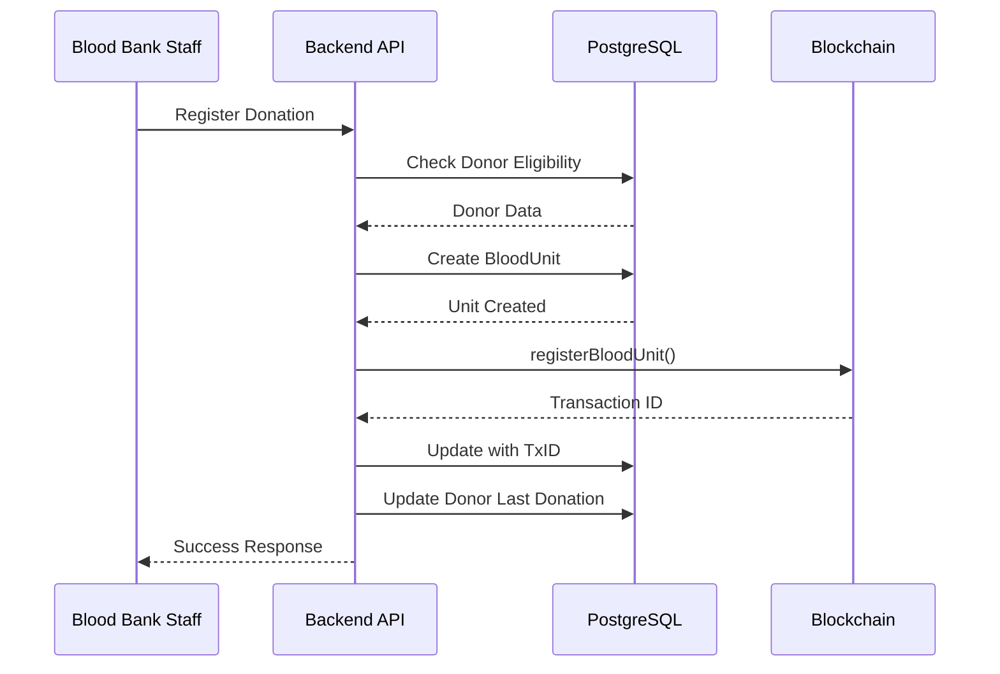

# Task 8: Blood Donation Registration Service

## Overview
Handle blood donation workflow with blockchain recording.

## Status: `[ ] Not Started`

---

## Objectives
- Register new blood donations
- Generate unique blood unit IDs
- Record donation on blockchain
- Store encrypted donor data off-chain

---

## Deliverables

### 1. Donation Service (`src/services/donation.service.ts`)
```typescript
import { prisma } from '@/lib/prisma';
import { encryptionService } from '@/lib/encryption';
import { fabricService } from '@/lib/fabric';
import { BloodGroup, UnitStatus } from '@prisma/client';
import { nanoid } from 'nanoid';

export interface CreateDonationInput {
  donorId: string;
  organizationId: string;
  bloodGroup: BloodGroup;
  volumeMl?: number;
  collectedBy: string;
}

export class DonationService {
  /**
   * Generate unique blood unit code
   */
  private generateUnitCode(): string {
    const prefix = 'BU';
    const timestamp = Date.now().toString(36).toUpperCase();
    const random = nanoid(6).toUpperCase();
    return `${prefix}-${timestamp}-${random}`;
  }

  /**
   * Register a new blood donation
   */
  async create(input: CreateDonationInput) {
    // Check donor eligibility
    const donor = await prisma.donor.findUnique({
      where: { id: input.donorId }
    });

    if (!donor) {
      throw new Error('Donor not found');
    }

    if (!donor.isEligible) {
      throw new Error('Donor is not eligible for donation');
    }

    // Generate unique code and calculate expiry
    const unitCode = this.generateUnitCode();
    const collectionDate = new Date();
    const expiryDate = new Date(collectionDate);
    expiryDate.setDate(expiryDate.getDate() + 42); // 42-day shelf life

    // Create data hash for blockchain
    const dataForHash = JSON.stringify({
      donorId: input.donorId,
      bloodGroup: input.bloodGroup,
      collectionDate: collectionDate.toISOString(),
    });
    const dataHash = encryptionService.hash(dataForHash);

    // Create blood unit in database
    const bloodUnit = await prisma.bloodUnit.create({
      data: {
        unitCode,
        bloodGroup: input.bloodGroup,
        status: UnitStatus.COLLECTED,
        volumeMl: input.volumeMl || 450,
        donorId: input.donorId,
        organizationId: input.organizationId,
        collectionDate,
        expiryDate,
        dataHash,
      }
    });

    // Record on blockchain
    try {
      const txId = await fabricService.registerBloodUnit({
        unitId: bloodUnit.id,
        unitCode,
        bloodGroup: input.bloodGroup,
        organizationId: input.organizationId,
        dataHash,
        timestamp: collectionDate.toISOString(),
      });

      // Update with blockchain transaction ID
      await prisma.bloodUnit.update({
        where: { id: bloodUnit.id },
        data: { blockchainTxId: txId }
      });
    } catch (error) {
      console.error('Blockchain recording failed:', error);
      // Continue - blockchain recording can be retried
    }

    // Update donor's last donation date and eligibility
    await prisma.donor.update({
      where: { id: input.donorId },
      data: {
        lastDonationDate: collectionDate,
        isEligible: false, // Will be eligible after 56 days
      }
    });

    // Create audit log
    await prisma.auditLog.create({
      data: {
        userId: input.collectedBy,
        action: 'DONATION_REGISTERED',
        entityType: 'BloodUnit',
        entityId: bloodUnit.id,
        details: `Blood unit ${unitCode} collected`,
      }
    });

    return bloodUnit;
  }

  /**
   * Get donation by ID
   */
  async getById(id: string) {
    return prisma.bloodUnit.findUnique({
      where: { id },
      include: {
        donor: true,
        organization: true,
        tests: true,
        transfers: true,
      }
    });
  }

  /**
   * Get donation by unit code
   */
  async getByCode(unitCode: string) {
    return prisma.bloodUnit.findUnique({
      where: { unitCode },
      include: {
        tests: true,
        transfers: true,
      }
    });
  }

  /**
   * Update donation status
   */
  async updateStatus(id: string, status: UnitStatus, updatedBy: string) {
    const unit = await prisma.bloodUnit.update({
      where: { id },
      data: { status }
    });

    // Record status change on blockchain
    try {
      await fabricService.updateBloodStatus({
        unitId: id,
        status,
        updatedBy,
        timestamp: new Date().toISOString(),
      });
    } catch (error) {
      console.error('Blockchain status update failed:', error);
    }

    // Create audit log
    await prisma.auditLog.create({
      data: {
        userId: updatedBy,
        action: 'STATUS_UPDATED',
        entityType: 'BloodUnit',
        entityId: id,
        details: `Status changed to ${status}`,
      }
    });

    return unit;
  }

  /**
   * Get donations by donor
   */
  async getByDonor(donorId: string) {
    return prisma.bloodUnit.findMany({
      where: { donorId },
      orderBy: { collectionDate: 'desc' },
      include: { tests: true }
    });
  }

  /**
   * Get donations by organization
   */
  async getByOrganization(organizationId: string, filters?: {
    status?: UnitStatus;
    bloodGroup?: BloodGroup;
  }) {
    return prisma.bloodUnit.findMany({
      where: {
        organizationId,
        ...(filters?.status && { status: filters.status }),
        ...(filters?.bloodGroup && { bloodGroup: filters.bloodGroup }),
      },
      orderBy: { collectionDate: 'desc' }
    });
  }
}

export const donationService = new DonationService();
```

### 2. API Routes

#### Register Donation (`src/app/api/donations/register/route.ts`)
```typescript
import { NextRequest, NextResponse } from 'next/server';
import { withPermission } from '@/lib/auth-middleware';
import { PERMISSIONS } from '@/lib/permissions';
import { donationService } from '@/services/donation.service';
import { getServerSession } from 'next-auth';
import { authOptions } from '@/app/api/auth/[...nextauth]/route';

export const POST = withPermission(
  PERMISSIONS.CREATE_DONATION,
  async (req: NextRequest) => {
    try {
      const session = await getServerSession(authOptions);
      const body = await req.json();

      const donation = await donationService.create({
        ...body,
        collectedBy: session!.user.id,
      });

      return NextResponse.json(donation);
    } catch (error: any) {
      return NextResponse.json(
        { error: error.message }, 
        { status: 400 }
      );
    }
  }
);
```

---

## Workflow



---

## API Endpoints

| Method | Endpoint | Description |
|--------|----------|-------------|
| POST | `/api/donations/register` | Register new donation |
| GET | `/api/donations/:id` | Get donation details |
| PUT | `/api/donations/:id/status` | Update status |
| GET | `/api/donations/donor/:donorId` | Get donor's donations |

---

## Acceptance Criteria
- [ ] Unique blood unit code generated
- [ ] Donation recorded in database
- [ ] Donation recorded on blockchain
- [ ] Donor eligibility updated
- [ ] Audit log created
- [ ] Expiry date calculated correctly (42 days)

---

## Dependencies
- Task 7 (Donor service)
- Task 3 (Fabric setup)
- Task 14 (Blockchain integration)

## Blocks
- Task 9 (Testing service)
- Task 10 (Inventory management)
