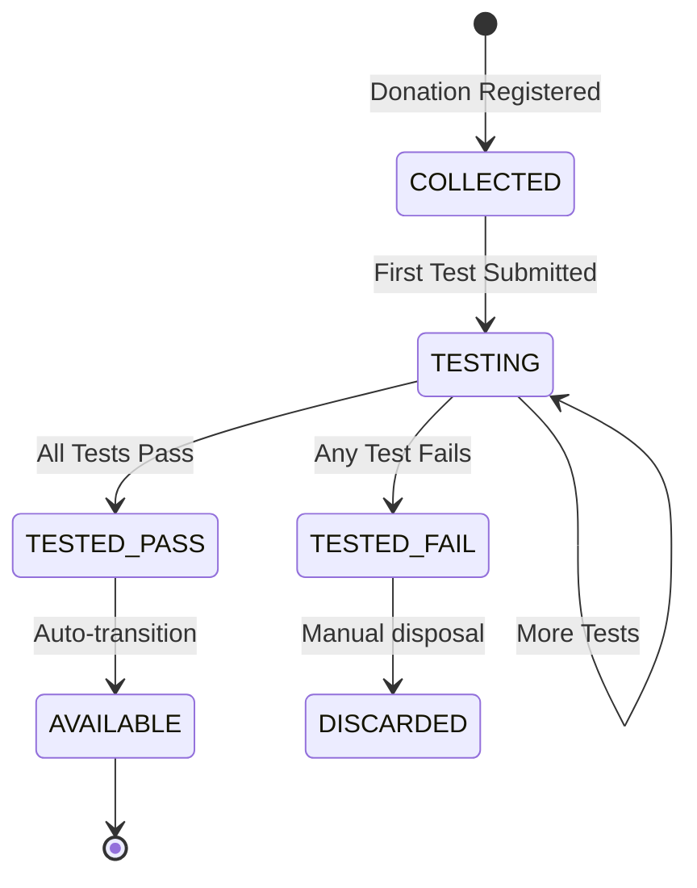

# Task 9: Testing & Verification Service

## Overview
Manage blood unit testing and verification workflow.

## Status: `[ ] Not Started`

---

## Objectives
- Record blood test results
- Update blood unit status based on tests
- Record test hash on blockchain
- Prevent unverified units from being issued

---

## Deliverables

### 1. Test Types

| Test Type | Code | Description |
|-----------|------|-------------|
| Blood Typing | `ABO_RH` | ABO and Rh factor determination |
| HIV | `HIV` | HIV 1/2 antibody screening |
| Hepatitis B | `HBV` | Hepatitis B surface antigen |
| Hepatitis C | `HCV` | Hepatitis C antibody |
| Syphilis | `VDRL` | VDRL/RPR test |
| Malaria | `MALARIA` | Malaria parasite detection |

### 2. Testing Service (`src/services/testing.service.ts`)
```typescript
import { prisma } from '@/lib/prisma';
import { encryptionService } from '@/lib/encryption';
import { fabricService } from '@/lib/fabric';
import { UnitStatus } from '@prisma/client';

export const TEST_TYPES = [
  'ABO_RH',
  'HIV',
  'HBV',
  'HCV',
  'VDRL',
  'MALARIA',
] as const;

export type TestType = typeof TEST_TYPES[number];

export interface CreateTestInput {
  bloodUnitId: string;
  testType: TestType;
  result: 'POSITIVE' | 'NEGATIVE' | 'INCONCLUSIVE';
  testedBy: string;
  notes?: string;
}

export class TestingService {
  /**
   * Submit a test result
   */
  async submitTest(input: CreateTestInput) {
    const bloodUnit = await prisma.bloodUnit.findUnique({
      where: { id: input.bloodUnitId }
    });

    if (!bloodUnit) {
      throw new Error('Blood unit not found');
    }

    // Create result hash for blockchain
    const resultData = JSON.stringify({
      bloodUnitId: input.bloodUnitId,
      testType: input.testType,
      result: input.result,
      testedBy: input.testedBy,
      timestamp: new Date().toISOString(),
    });
    const resultHash = encryptionService.hash(resultData);

    // Create test record
    const test = await prisma.bloodTest.create({
      data: {
        bloodUnitId: input.bloodUnitId,
        testType: input.testType,
        result: input.result,
        testedBy: input.testedBy,
        testDate: new Date(),
        resultHash,
      }
    });

    // Record on blockchain
    try {
      const txId = await fabricService.recordTestStatus({
        unitId: input.bloodUnitId,
        testType: input.testType,
        resultHash,
        status: input.result,
        timestamp: new Date().toISOString(),
      });

      await prisma.bloodTest.update({
        where: { id: test.id },
        data: { blockchainTxId: txId }
      });
    } catch (error) {
      console.error('Blockchain test recording failed:', error);
    }

    // Update blood unit status if test failed
    if (input.result === 'POSITIVE' && input.testType !== 'ABO_RH') {
      await prisma.bloodUnit.update({
        where: { id: input.bloodUnitId },
        data: { status: UnitStatus.TESTED_FAIL }
      });
    }

    // Check if all tests completed and passed
    await this.checkAllTestsComplete(input.bloodUnitId);

    // Audit log
    await prisma.auditLog.create({
      data: {
        userId: input.testedBy,
        action: 'TEST_SUBMITTED',
        entityType: 'BloodTest',
        entityId: test.id,
        details: `${input.testType}: ${input.result}`,
      }
    });

    return test;
  }

  /**
   * Check if all required tests are complete and passed
   */
  async checkAllTestsComplete(bloodUnitId: string) {
    const tests = await prisma.bloodTest.findMany({
      where: { bloodUnitId }
    });

    const completedTestTypes = tests.map(t => t.testType);
    const allComplete = TEST_TYPES.every(t => completedTestTypes.includes(t));
    const allPassed = tests.every(t => 
      t.testType === 'ABO_RH' || t.result === 'NEGATIVE'
    );

    if (allComplete) {
      await prisma.bloodUnit.update({
        where: { id: bloodUnitId },
        data: { 
          status: allPassed ? UnitStatus.TESTED_PASS : UnitStatus.TESTED_FAIL 
        }
      });

      // If passed, make available
      if (allPassed) {
        await prisma.bloodUnit.update({
          where: { id: bloodUnitId },
          data: { status: UnitStatus.AVAILABLE }
        });
      }
    } else {
      await prisma.bloodUnit.update({
        where: { id: bloodUnitId },
        data: { status: UnitStatus.TESTING }
      });
    }
  }

  /**
   * Get tests for a blood unit
   */
  async getTestsByUnit(bloodUnitId: string) {
    return prisma.bloodTest.findMany({
      where: { bloodUnitId },
      orderBy: { testDate: 'desc' }
    });
  }

  /**
   * Get pending tests (blood units needing tests)
   */
  async getPendingTests(organizationId: string) {
    const unitsNeedingTests = await prisma.bloodUnit.findMany({
      where: {
        organizationId,
        status: { in: [UnitStatus.COLLECTED, UnitStatus.TESTING] }
      },
      include: { tests: true }
    });

    return unitsNeedingTests.map(unit => {
      const completedTests = unit.tests.map(t => t.testType);
      const pendingTests = TEST_TYPES.filter(t => !completedTests.includes(t));
      return {
        bloodUnit: unit,
        pendingTests,
        completedTests,
      };
    });
  }

  /**
   * Verify test result integrity using blockchain
   */
  async verifyTestIntegrity(testId: string) {
    const test = await prisma.bloodTest.findUnique({
      where: { id: testId }
    });

    if (!test || !test.blockchainTxId) {
      return { verified: false, reason: 'No blockchain record' };
    }

    // Get hash from blockchain
    const blockchainHash = await fabricService.getTestHash(
      test.bloodUnitId, 
      test.testType
    );

    return {
      verified: blockchainHash === test.resultHash,
      localHash: test.resultHash,
      blockchainHash,
    };
  }
}

export const testingService = new TestingService();
```

### 3. API Routes

#### Submit Test (`src/app/api/tests/submit/route.ts`)
```typescript
import { NextRequest, NextResponse } from 'next/server';
import { withPermission } from '@/lib/auth-middleware';
import { PERMISSIONS } from '@/lib/permissions';
import { testingService } from '@/services/testing.service';
import { getServerSession } from 'next-auth';
import { authOptions } from '@/app/api/auth/[...nextauth]/route';

export const POST = withPermission(
  PERMISSIONS.CREATE_TEST,
  async (req: NextRequest) => {
    try {
      const session = await getServerSession(authOptions);
      const body = await req.json();

      const test = await testingService.submitTest({
        ...body,
        testedBy: session!.user.id,
      });

      return NextResponse.json(test);
    } catch (error: any) {
      return NextResponse.json(
        { error: error.message }, 
        { status: 400 }
      );
    }
  }
);
```

---

## Testing Workflow



---

## API Endpoints

| Method | Endpoint | Description |
|--------|----------|-------------|
| POST | `/api/tests/submit` | Submit test result |
| GET | `/api/tests/:bloodUnitId` | Get tests for unit |
| GET | `/api/tests/pending` | Get pending tests |
| GET | `/api/tests/:id/verify` | Verify test integrity |

---

## Acceptance Criteria
- [ ] All test types can be submitted
- [ ] Failed tests mark unit as TESTED_FAIL
- [ ] All passed tests mark unit as AVAILABLE
- [ ] Test hash recorded on blockchain
- [ ] Integrity verification works

---

## Dependencies
- Task 8 (Blood donation - creates units)
- Task 14 (Blockchain integration)

## Blocks
- Task 10 (Inventory - uses test status)
- Task 11 (Issuance - requires passed tests)
